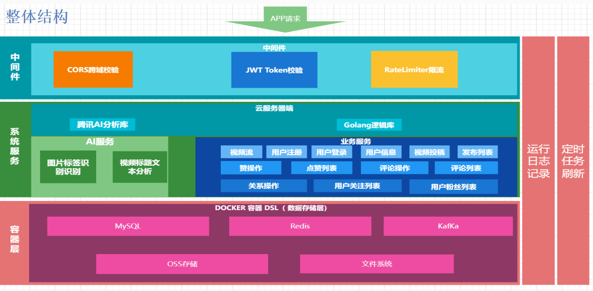

# Sbyter Man

## 一、介绍
本项目设计技术包括：Golang，Gin，Gorm，MySQL，Redis，Kafka，Cron。实现了”简约版“抖音的基本功能，包括的扩展功能有：登录注册的邮箱验证、
kakfa的异步任务等。


## 数据库定义语句

```
-- douyin.douyin_comment definition

CREATE TABLE `douyin_comment` (
  `id` int NOT NULL AUTO_INCREMENT,
  `user_id` int NOT NULL,
  `video_id` int NOT NULL,
  `content` varchar(100) NOT NULL,
  `created_at` timestamp NOT NULL,
  `updated_at` timestamp NULL DEFAULT NULL,
  `deleted_at` timestamp NULL DEFAULT NULL,
  PRIMARY KEY (`id`)
) ENGINE=InnoDB AUTO_INCREMENT=71 DEFAULT CHARSET=utf8mb4 COLLATE=utf8mb4_0900_ai_ci;


-- douyin.douyin_favorite definition

CREATE TABLE `douyin_favorite` (
  `id` int NOT NULL AUTO_INCREMENT,
  `user_id` int NOT NULL,
  `video_id` int NOT NULL,
  `created_at` int NOT NULL,
  `updated_at` int NOT NULL,
  PRIMARY KEY (`id`),
  UNIQUE KEY `user_video_un` (`user_id`,`video_id`),
  KEY `video_id_index` (`video_id`)
) ENGINE=InnoDB AUTO_INCREMENT=11 DEFAULT CHARSET=utf8mb4 COLLATE=utf8mb4_0900_ai_ci;


-- douyin.douyin_tag definition

CREATE TABLE `douyin_tag` (
  `id` int NOT NULL AUTO_INCREMENT COMMENT '标签id',
  `name` varchar(100) NOT NULL COMMENT '标签名',
  PRIMARY KEY (`id`),
  UNIQUE KEY `douyin_tag_UN` (`name`),
  KEY `douyin_tag_name_IDX` (`name`) USING BTREE
) ENGINE=InnoDB AUTO_INCREMENT=13 DEFAULT CHARSET=utf8mb4 COLLATE=utf8mb4_0900_ai_ci COMMENT='视频的一些标签类别';


-- douyin.douyin_user definition

CREATE TABLE `douyin_user` (
  `id` int NOT NULL AUTO_INCREMENT,
  `user_name` varchar(100) NOT NULL,
  `password` varchar(100) NOT NULL,
  `follow_count` int NOT NULL,
  `follower_count` int NOT NULL,
  `created_at` int NOT NULL,
  `updated_at` int NOT NULL,
  `avatar` varchar(100) NOT NULL,
  `signature` varchar(200) CHARACTER SET utf8mb4 COLLATE utf8mb4_0900_ai_ci NOT NULL,
  `background_image` varchar(100) NOT NULL,
  `login_ip` varchar(100) DEFAULT NULL COMMENT '最近登录的ip',
  `total_favorited` bigint NOT NULL DEFAULT '0' COMMENT '被赞总次数',
  `favorite_count` bigint NOT NULL DEFAULT '0' COMMENT '喜欢的总数量',
  PRIMARY KEY (`id`),
  UNIQUE KEY `douyin_user_UN` (`user_name`)
) ENGINE=InnoDB AUTO_INCREMENT=58 DEFAULT CHARSET=utf8mb4 COLLATE=utf8mb4_0900_ai_ci;


-- douyin.douyin_video definition

CREATE TABLE `douyin_video` (
  `id` int NOT NULL AUTO_INCREMENT COMMENT '编号id',
  `author_id` int NOT NULL COMMENT '作者id',
  `play_url` varchar(300) CHARACTER SET utf8mb4 COLLATE utf8mb4_general_ci DEFAULT NULL COMMENT '视频播放地址',
  `cover_url` varchar(300) CHARACTER SET utf8mb4 COLLATE utf8mb4_general_ci DEFAULT NULL COMMENT '视频封面地址',
  `favorite_count` int DEFAULT '0' COMMENT '视频的点赞总数',
  `comment_count` int DEFAULT '0' COMMENT '视频的评论总数',
  `title` varchar(100) CHARACTER SET utf8mb4 COLLATE utf8mb4_general_ci DEFAULT NULL COMMENT '视频标题',
  `tags` varchar(256) CHARACTER SET utf8mb4 COLLATE utf8mb4_general_ci DEFAULT NULL COMMENT '视频标签（解析自标题）',
  `publish_date` timestamp NULL DEFAULT NULL COMMENT '发布时期',
  `created_at` timestamp NULL DEFAULT NULL,
  `updated_at` timestamp NULL DEFAULT NULL,
  `deleted_at` timestamp NULL DEFAULT NULL,
  PRIMARY KEY (`id`)
) ENGINE=InnoDB AUTO_INCREMENT=78 DEFAULT CHARSET=utf8mb4 COLLATE=utf8mb4_general_ci;


-- douyin.douyin_follow definition

CREATE TABLE `douyin_follow` (
  `id` int unsigned NOT NULL AUTO_INCREMENT,
  `created_at` int DEFAULT NULL,
  `updated_at` int DEFAULT NULL,
  `followed_id` int DEFAULT NULL,
  `follower_id` int DEFAULT NULL,
  PRIMARY KEY (`id`) USING BTREE,
  UNIQUE KEY `uniq_idx` (`follower_id`,`followed_id`) USING BTREE,
  KEY `followed_id` (`followed_id`),
  CONSTRAINT `douyin_follow_ibfk_1` FOREIGN KEY (`followed_id`) REFERENCES `douyin_user` (`id`),
  CONSTRAINT `douyin_follow_ibfk_2` FOREIGN KEY (`follower_id`) REFERENCES `douyin_user` (`id`)
) ENGINE=InnoDB AUTO_INCREMENT=178 DEFAULT CHARSET=utf8mb4 COLLATE=utf8mb4_0900_ai_ci ROW_FORMAT=DYNAMIC;
```


## 三、目录介绍

### 3.1 主目录

|            |                     |
| ---------- | ------------------- |
| 文件夹名称 | 功能                |
| configs    | 配置文件            |
| docs       | swager api文档/其他 |
| global     | 全局变量            |
| internal   | 内部功能实现        |
| pkg        | 公共模块实现        |
| scripts    | 脚本实现            |
| storage    | 缓存/日志文件存储   |
| cronjob    | 定时处理任务        |

### 3.2 internal/ 文件夹目录

|            |                                                              |
| ---------- | ------------------------------------------------------------ |
| 文件夹名称 | 功能                                                         |
| model      | 数据库原型（结构体定义），还要一些数据库的CRUD               |
| dao        | 数据访问层（Database Access Object），所有与数据相关的操作都会在 dao 层进行，例如 MySQL、ElasticSearch 等。 |
| sevice     | 组合数据库操作，完成具体功能。                               |
| controller | API交互，进行参数校验，请求service层，进行响应。             |
| middleware | 请求API之前的 中间件                                         |
| cache      | 缓存模块，缓存的crud操作                                     |

### 3.3 pkg/ 文件夹目录

|            |                                                          |
| ---------- | -------------------------------------------------------- |
| 文件夹名称 | 功能                                                     |
| app        | JWT、分页、表单等公共函数                                |
| convert    | 字符串和数字转换相关函数                                 |
| email      | 邮件相关函数                                             |
| errcode    | 错误码统一处理                                           |
| image      | 图片识别监测相关函数                                     |
| limiter    | 限流桶相关函数                                           |
| logger     | 日志相关                                                 |
| oss        | OSS存储相关                                              |
| setting    | 系统设置相关                                             |
| upload     | 上传本地文件相关                                         |
| util       | 其他公共函数如UUID生成、随机生成一些个人信息、加密等操作 |

## 四、定时cron

在目录cronjob下，DouyinCron结构体内嵌了dao.Dao,cache.Redis，提供了相应的操作给定时任务使用。在cronjon/favorite下定义了定时任务，定时时间可以使用cron在线生成器产生，如果有其他定时需求可以根据cronjob下的test文件添加。

在main.go中有定时任务的设置函数setuoCron，定义了相应的待执行任务需要在此添加定时任务。

## 五、一些Tips

1. 对于公共相应模块提取在了sevice.go 的 ResponseCommon 结构体中：

```
type ResponseCommon struct {
    StatusCode int    `json:"status_code"`
    StatusMsg  string `json:"status_msg"`
}
```

1. 对于每次请求需要接收的token，在本项目中，不论是Get方法还是Post方法，都将token放在了请求参数中，因此无需解析请求头，直接获取请求参数即可。然后调用app.CheckToken函数验证token是否有效。


## 六、 演示视频
https://sbyterman.oss-cn-hangzhou.aliyuncs.com/video/file_v2_09cbcc8a-8ef9-486d-900f-7514bca3b53g_2033260184.mp4
##  七、安装教程

```go
//安装项目所需模块 
go mod tidy

安装如下所有模块
	github.com/Shopify/sarama v1.34.0
	github.com/aliyun/aliyun-oss-go-sdk v2.2.4+incompatible
	github.com/dgrijalva/jwt-go v3.2.0+incompatible
	github.com/gin-gonic/gin v1.8.0
	github.com/go-playground/locales v0.14.0
	github.com/go-playground/universal-translator v0.18.0
	github.com/go-playground/validator/v10 v10.11.0
	github.com/go-redis/redis v6.15.9+incompatible
	github.com/google/uuid v1.3.0
	github.com/juju/ratelimit v1.0.1
	github.com/mattn/go-colorable v0.1.12
	github.com/robfig/cron/v3 v3.0.1
	github.com/spf13/viper v1.12.0
	github.com/tencentcloud/tencentcloud-sdk-go/tencentcloud/common v1.0.409
	github.com/tencentcloud/tencentcloud-sdk-go/tencentcloud/tiia v1.0.409
	golang.org/x/crypto v0.0.0-20220525230936-793ad666bf5e
	gopkg.in/gomail.v2 v2.0.0-20160411212932-81ebce5c23df
	gopkg.in/natefinch/lumberjack.v2 v2.0.0
	gorm.io/driver/mysql v1.3.4
	gorm.io/gorm v1.23.5
```

## 八、 使用说明

```go
go run main.go
```

