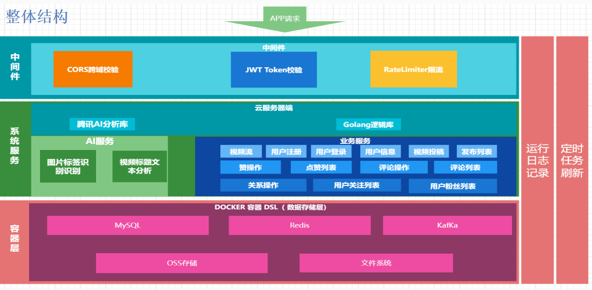

# Sbyter Man

## 一、介绍
本项目设计技术包括：Golang，Gin，Gorm，MySQL，Redis，Kafka，Cron。实现了”简约版“抖音的基本功能，包括的扩展功能有：登录注册的邮箱验证、
kakfa的异步任务等。



## 二、数据库定义语句

见[数据库ddl文件](ddl)

## 三、目录介绍

### 3.1 主目录

|            |                     |
| ---------- | ------------------- |
| 文件夹名称 | 功能                |
| configs    | 配置文件            |
| docs       | swager api文档/其他 |
| global     | 全局变量            |
| internal   | 内部功能实现        |
| pkg        | 公共模块实现        |
| scripts    | 脚本实现            |
| storage    | 缓存/日志文件存储   |
| cronjob    | 定时处理任务        |

### 3.2 internal/ 文件夹目录

|            |                                                              |
| ---------- | ------------------------------------------------------------ |
| 文件夹名称 | 功能                                                         |
| model      | 数据库原型（结构体定义），还要一些数据库的CRUD               |
| dao        | 数据访问层（Database Access Object），所有与数据相关的操作都会在 dao 层进行，例如 MySQL、ElasticSearch 等。 |
| sevice     | 组合数据库操作，完成具体功能。                               |
| controller | API交互，进行参数校验，请求service层，进行响应。             |
| middleware | 请求API之前的 中间件                                         |
| cache      | 缓存模块，缓存的crud操作                                     |

### 3.3 pkg/ 文件夹目录

|            |                                                          |
| ---------- | -------------------------------------------------------- |
| 文件夹名称 | 功能                                                     |
| app        | JWT、分页、表单等公共函数                                |
| convert    | 字符串和数字转换相关函数                                 |
| email      | 邮件相关函数                                             |
| errcode    | 错误码统一处理                                           |
| image      | 图片识别监测相关函数                                     |
| limiter    | 限流桶相关函数                                           |
| logger     | 日志相关                                                 |
| oss        | OSS存储相关                                              |
| setting    | 系统设置相关                                             |
| upload     | 上传本地文件相关                                         |
| util       | 其他公共函数如UUID生成、随机生成一些个人信息、加密等操作 |

## 四、定时cron

在目录cronjob下，DouyinCron结构体内嵌了dao.Dao,cache.Redis，提供了相应的操作给定时任务使用。在cronjon/favorite下定义了定时任务，定时时间可以使用cron在线生成器产生，如果有其他定时需求可以根据cronjob下的test文件添加。

在main.go中有定时任务的设置函数setuoCron，定义了相应的待执行任务需要在此添加定时任务。

## 五、一些Tips

1. 对于公共相应模块提取在了sevice.go 的 ResponseCommon 结构体中：

```
type ResponseCommon struct {
    StatusCode int    `json:"status_code"`
    StatusMsg  string `json:"status_msg"`
}
```

1. 对于每次请求需要接收的token，在本项目中，不论是Get方法还是Post方法，都将token放在了请求参数中，因此无需解析请求头，直接获取请求参数即可。然后调用app.CheckToken函数验证token是否有效。


## 六、 演示视频
https://sbyterman.oss-cn-hangzhou.aliyuncs.com/video/file_v2_09cbcc8a-8ef9-486d-900f-7514bca3b53g_2033260184.mp4

##  七、安装教程

```shell
# 安装项目所需模块 
go mod tidy

# 运行
go run main.go
```

